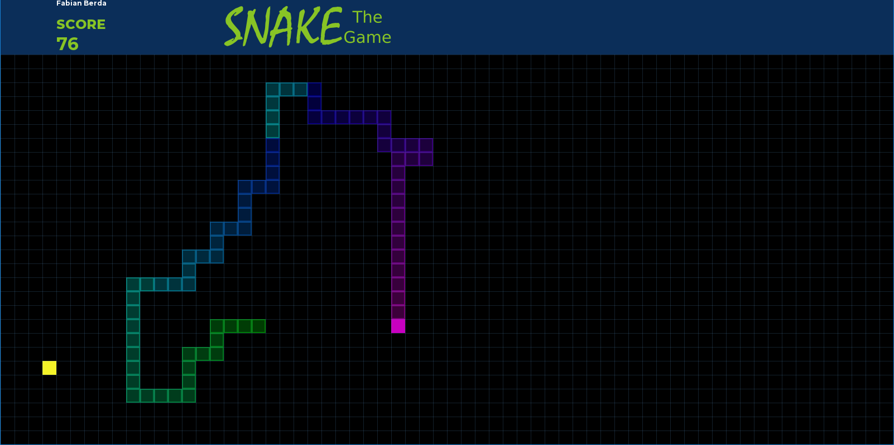

# Game C++ - Color Snake (org. Snake)

Gra została stworzona w celu nauki oraz przyswojenia działania biblioteki SFML. Gra jest w pewnym rodzaju wariacją klasycznej gry "Snake" znanej (chyba najbardziej) z niezniszczalnych telefonów firmy Nokia. Gra posiada możliwość dostosowania wielkości okna oraz rozmiaru pokarmu naszego węża.

## Opis działania gry

Gra od swojej oryginalnej wersji różni się małym dodatkiem mającym na celu umilić oko grającemu. Po zjadzeniu pokarmu gracz nie tylko uzyskuje wiecej punktów, przedłużenie węża ale również zmienia jego kolor. Wraz z każdym zdobytym pokarmem wąż zmienia swój kolor co widoczne jest dokładnie na zdjęciach zamieszczonych poniżej. Sterujemy wężem za pomocą strzałek lub klawiszy W, A, S, D. Główną zasdą jest nie zjedzenie swojego ogona oraz nie wyjechania poza krawędź mapy głową naszego węża. 

### Technologia

Do stworzenia gry została użyta nastepująca technologia:

- C++
- Biblioteka graficzna oraz multimedialna [SFML](https://www.sfml-dev.org/)

## Zdjęcia z gry

